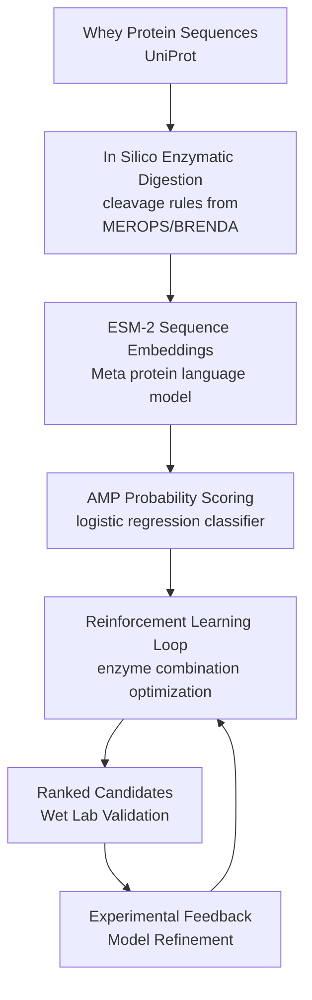

# HERALD
### Hydrolysis-guided Enzymatic Reinforcement for AMP Learning and Discovery

HERALD is a computational pipeline for machine learning-guided discovery of 
*antimicrobial peptides* (AMPs) from food proteins. It combines in silico 
enzymatic digestion, ESM-2 protein language model embeddings, and reinforcement 
learning to identify enzyme combinations that maximize the yield of AMP-like 
peptides from whey proteins.

The pipeline is designed as a closed computational–experimental loop:
computational predictions prioritize candidates for wet lab validation, and
experimental results refine the model for the next iteration.

---

## Motivation

Antibiotic resistance is a growing global health crisis. Antimicrobial peptides
derived from food proteins represent a promising class of natural alternatives.
However, identifying which enzymes and hydrolysis conditions produce the most
potent AMP-like fragments from proteins like whey is a combinatorially large
problem that is impractical to solve by wet lab experimentation alone.

HERALD addresses this by using machine learning to prioritize the most promising
enzyme combinations computationally, reducing the experimental search space to
a tractable set of high-confidence candidates.

---

## Pipeline Overview



---

## Project Structure

HERALD/

├── herald/                         # core pipeline modules

│   ├── proteins.py                 # UniProt sequence fetching and caching

│   ├── enzymes.py                  # enzyme cleavage rules and properties

│   ├── digestion.py                # in silico enzymatic digestion

│   ├── scoring.py                  # peptide feature and AMP scoring functions

│   ├── screening.py                # protein-enzyme screening workflow

│   ├── databases.py                # AMP database retrieval and preprocessing

│   ├── predictor.py                # ESM-2 embeddings and AMP classifier

│   ├── environment.py              # reinforcement learning environment

│   ├── agent.py                    # epsilon-greedy RL agent

│   └── training.py                 # RL training loop

│   └── report.py                   # human-readable output

├── notebooks/

│   ├── 01_digestion_exploration.ipynb     # single protein-enzyme walkthrough

│   ├── 02_enzyme_protein_screening.ipynb  # rule-based screening pipeline

│   ├── 03_ml_screening.ipynb             # ML-based screening pipeline

│   └── 04_rl_training.ipynb             # RL enzyme combination optimization

├── data/

│   ├── raw/                        # downloaded sequences and database files

│   └── processed/                  # cleaned datasets and model outputs

├── requirements.txt

└── README.md

---

## Installation

**Requirements:** Python 3.10+, pip

```bash
# clone the repository
git clone https://github.com/LukasBuecherl/herald.git
cd herald

# create and activate a virtual environment
python -m venv .venv
source .venv/bin/activate  # on Windows: .venv\Scripts\activate

# install dependencies
pip install -r requirements.txt
```

---

## Dependencies

torch
fair-esm
scikit-learn
pandas
numpy
biopython
requests
joblib
matplotlib
jupyter

---

## Databases

HERALD uses two curated AMP databases:

**APD6 (Antimicrobial Peptide Database)**
Downloaded automatically on first run via the UniProt REST API.
- 3,306 natural AMPs with known activity
- 2,580 animal AMPs with known activity

Citation: Wang et al., Nucleic Acids Research, 2016 (APD3); 2024 update (APD6)

**DBAASP (Database of Antimicrobial Activity and Structure of Peptides)**
Must be downloaded manually from https://dbaasp.org/search and placed in data/raw/.
Download all segments as CSV files named peptides_0_2000.csv, peptides_2000_4000.csv, etc.

Citation: Pirtskhalava et al., Antimicrobial Agents and Chemotherapy, 2021

After downloading DBAASP files, build the combined database by running:
```python
from herald.databases import build_amp_database
amp_df = build_amp_database()
```

---

## Usage

Run notebooks in order:

**Notebook 01 — Digestion Exploration**
Walks through in silico digestion of beta-lactoglobulin with trypsin step by step.
Validates the digestion pipeline and introduces peptide feature scoring.

**Notebook 02 — Rule-Based Screening**
Screens all whey proteins against all enzymes using physicochemical heuristics.
Produces enzyme_protein_screening_results.csv in data/processed/.

**Notebook 03 — ML Screening**
Trains an ESM-2 + logistic regression AMP classifier and runs ML-based screening.
Produces ml_screening_results.csv in data/processed/.
On first run, classifier training takes approximately 10-20 minutes on Apple Silicon.

**Notebook 04 — RL Optimization**
Trains an epsilon-greedy agent to learn the optimal enzyme combination for
lactoferrin hydrolysis. Produces a learning curve and ranked candidate peptides
for wet lab validation. Produces rl_candidates.csv in data/processed/.

---

## Classifier Performance

The AMP classifier was trained on 17,897 validated AMPs from APD6 and DBAASP
(positive examples) and 18,000 randomly generated peptide sequences (negative
examples).

| Metric | Value |
|---|---|
| Accuracy | 97% |
| Precision | 0.97 |
| Recall | 0.96 |
| F1-Score | 0.97 |
| ROC-AUC | 0.996 |

Evaluated on a held-out test set of 7,180 sequences (80/20 train/test split).

---

## Key Results

**ML Screening — Top protein-enzyme combinations (notebook 03):**

| Protein | Enzyme | Top Peptide | AMP Probability |
|---|---|---|---|
| Lactoferrin | Trypsin | LFVPALLSLGALGLCLAAPR | 0.9997 |
| Lactoferrin | Chymotrypsin | AVAVVKKANEGL | 0.9987 |
| Alpha-lactalbumin | Trypsin | FFVPLFLVGILFPAILAK | 0.9982 |
| BSA | Trypsin | GACLLPK | 0.9935 |

**RL Optimization — Agent recommendation (notebook 04):**

The epsilon-greedy agent converged on **trypsin alone** as the optimal enzyme
for lactoferrin hydrolysis after 100 training episodes.

| Action | Estimated Reward |
|---|---|
| Trypsin | 0.857 ← recommended |
| Chymotrypsin | 0.846 |
| Pepsin | 0.838 |
| Pepsin → Trypsin | 0.826 |
| Bromelain | 0.773 |
| Alcalase | 0.760 |
| Papain | 0.704 |
| Alcalase → Papain | 0.693 |

**Priority candidates for wet lab validation:**

| Peptide | AMP Probability | Evidence |
|---|---|---|
| LFVPALLSLGALGLCLAAPR | 0.9997 | ML screening + RL optimization |
| QVLLHQQALFGK | 0.9759 | Rule-based + ML screening + RL optimization |
| DSALGFLR | 0.9890 | RL optimization |

`QVLLHQQALFGK` is the most cross-validated candidate — identified independently
by rule-based scoring, ML screening, and RL optimization.

---

## Known Limitations

- Negative training examples are randomly generated peptide sequences rather than experimentally validated non-AMP peptides. This is a common baseline approach in AMP classification literature and will be refined in future versions.
- The RL agent uses pH and temperature optimal conditions from the BRENDA enzyme database as fixed parameters. Kinetic modeling of condition-dependent activity as a function of deviation from optimum is planned.
- Wet lab validation of computational predictions is ongoing.

---

## Roadmap

- [x] In silico digestion pipeline
- [x] Sequential multi-enzyme digestion
- [x] Rule-based AMP scoring
- [x] AMP database integration (APD6, DBAASP)
- [x] ESM-2 embedding and classifier (97% accuracy, ROC-AUC 0.996)
- [x] ML-based screening pipeline
- [x] Reinforcement learning optimization loop
- [x] pH and temperature in action space
- [x] Expanded enzyme library (trypsin, chymotrypsin, alcalase, pepsin, papain, bromelain)
- [x] Clean output report for wet lab collaborators
- [ ] pH and temperature activity modeling (PINN-based kinetic constraints)
- [ ] Wet lab validation and model recalibration with experimental MIC values
- [ ] UniProt-derived negative examples for classifier retraining
- [ ] LLM policy upgrade for RL agent (Level 2 — language model as policy)
- [ ] Additional whey proteins and enzyme combinations
- [ ] bioRxiv preprint

---

## Citation

If you use HERALD in your research, please cite: 

Buecherl, L. (2026). HERALD: Hydrolysis-guided Enzymatic Reinforcement for AMP Learning and Discovery. bioRxiv. [preprint — forthcoming]

---

## License

MIT License — see LICENSE for details.

---

## Acknowledgements

AMP database resources: APD6 (University of Nebraska Medical Center)
and DBAASP (Tbilisi State University).

ESM-2 protein language model: Meta AI Research.
